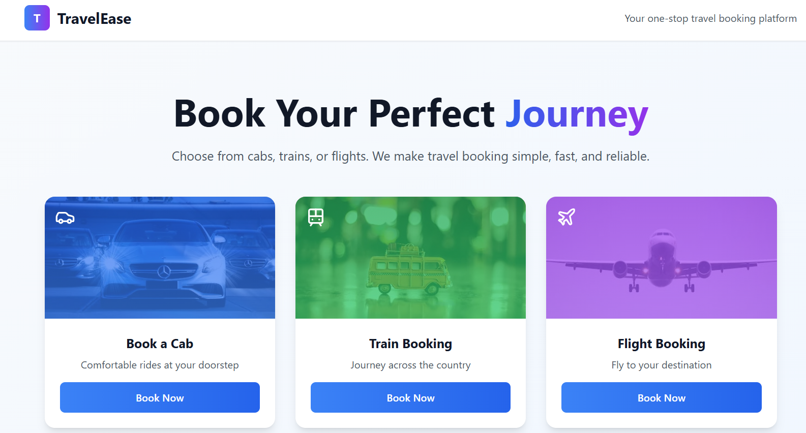
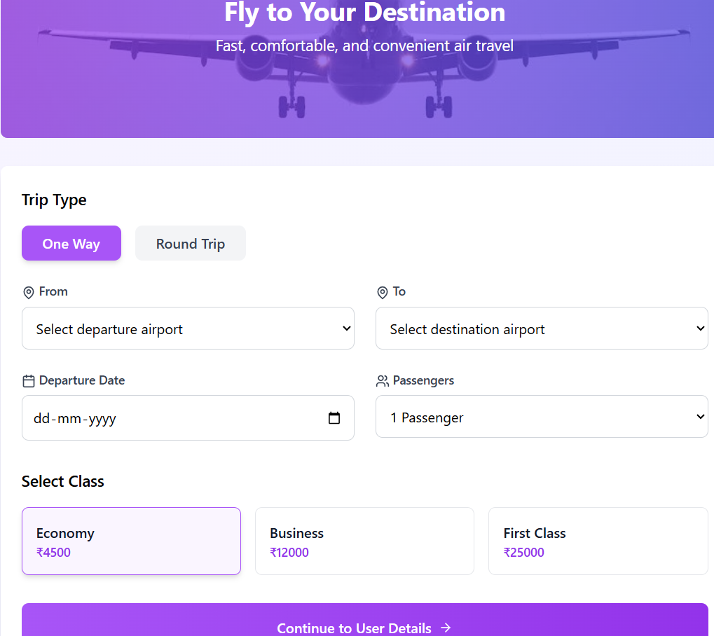
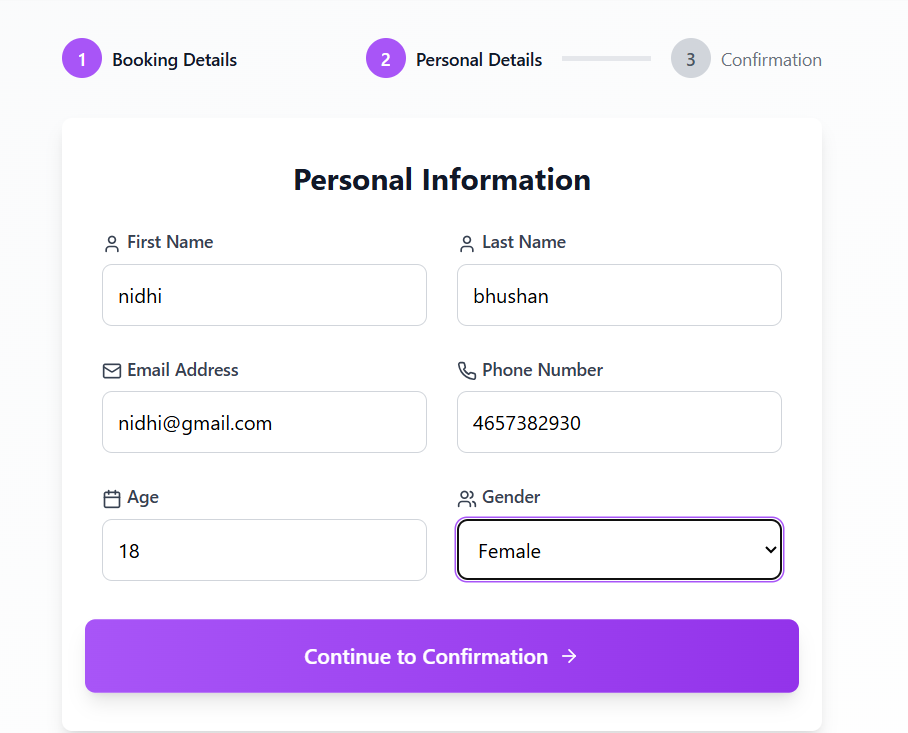
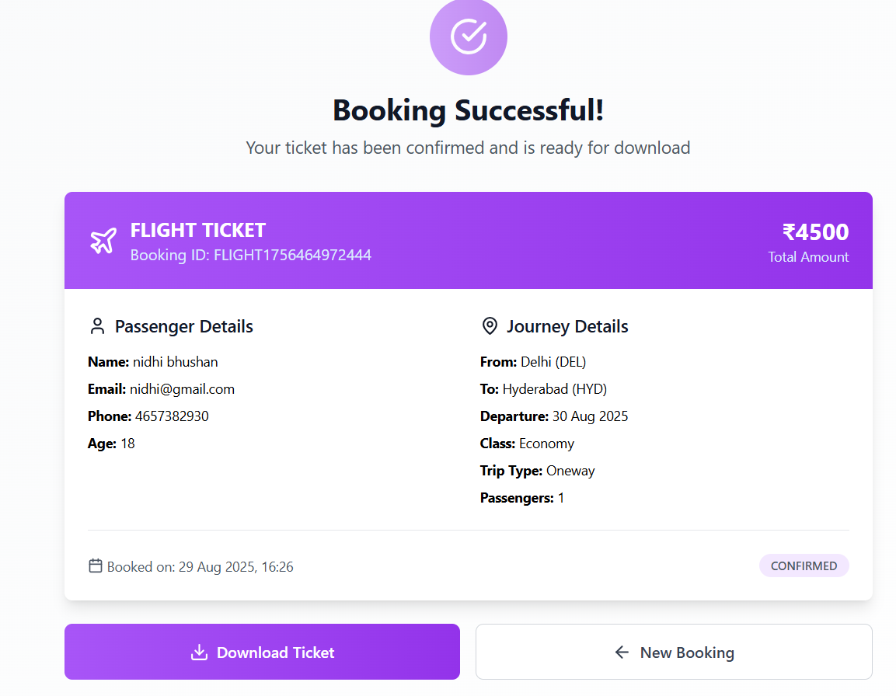
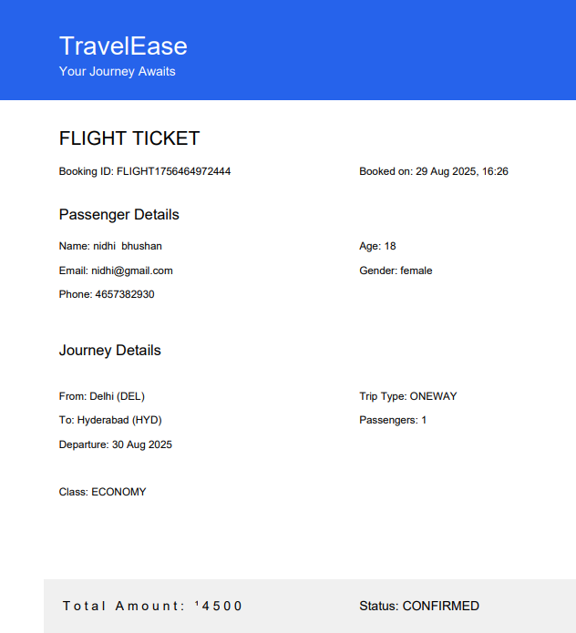

# TravelEase – Online Travel Booking System  

TravelEase is a simple and user-friendly travel booking system where users can book **Cabs, Trains, and Flights**.  
The platform provides an easy booking flow where users can choose their preferred mode of transport, fill in their details, and download their ticket.  

---

## Choose Your Mode of Transport  
The user can select the type of journey they want to book:  
- **Cab** – Comfortable rides at your doorstep  
- **Train** – Travel across the country  
- **Flight** – Fly to your destination  

## Booking Details (Example: Flight Booking)  
Once the user selects **Flight Booking**, they can:  
- Choose **One Way** or **Round Trip**  
- Select Departure & Destination Airports
- Enter Date of Travel 
- Choose the Number of Passengers
- Pick their Travel Class (Economy, Business, First Class)  

##  User Personal Details  
Before confirming the booking, the user needs to provide personal details such as:  
- First Name & Last Name  
- Email & Phone Number  
- Age & Gender  

## Booking Successfull
Confirms your booking by showing all the required details .

## Confirmation & Ticket Download  
After filling in all details, the user can proceed to **confirmation** and download their **ticket in PDF format**.  

## Features  
✔️ Book Cabs, Trains, or Flights  
✔️ Easy-to-use interface  
✔️ Multiple travel classes (Economy, Business, First Class)  
✔️ User detail form for secure booking  
✔️ Download ticket in PDF  

